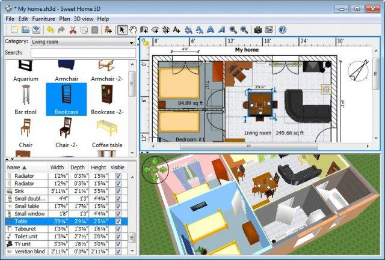
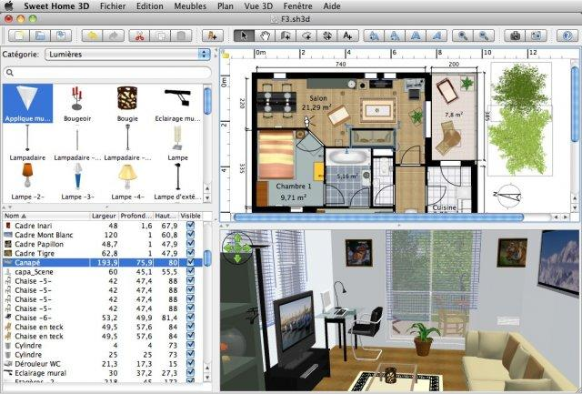
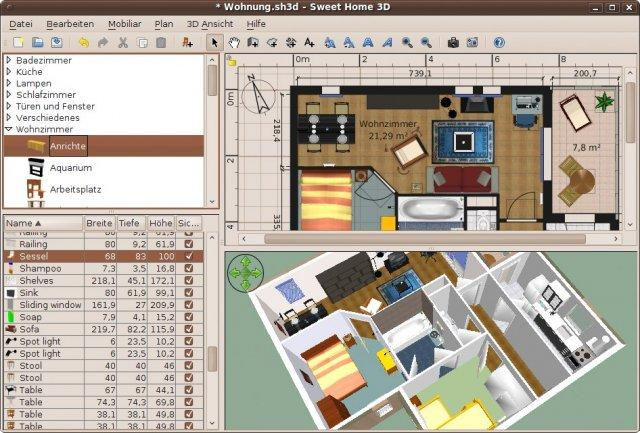
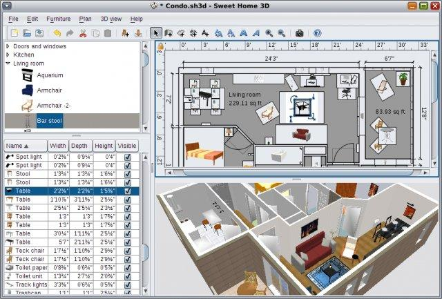
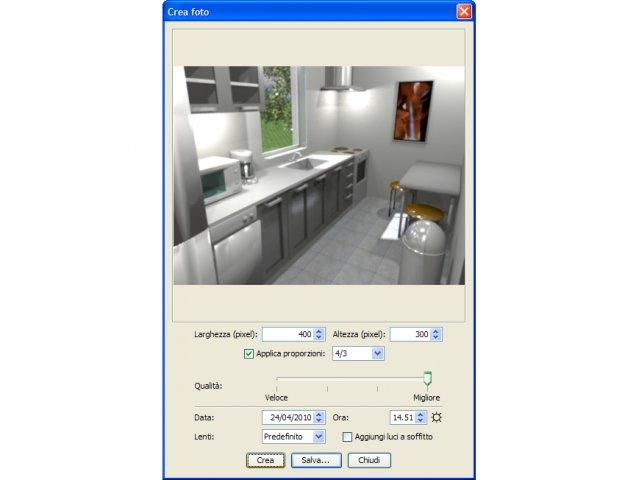
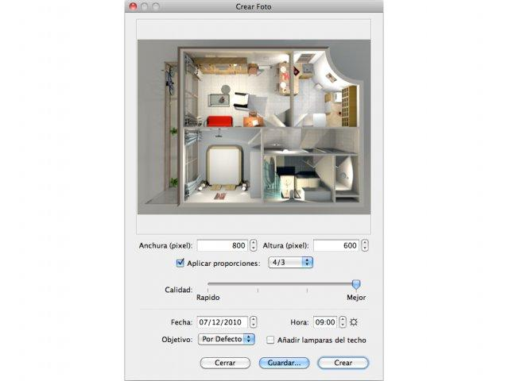

# Sweet Home 3D

**An interior design application to draw house plans & arrange furniture**

   

### 

[**⬇ Download Sweet Home 3D v7.5**](https://softgit.pro/p/sweet-home-3d) &nbsp;·&nbsp; [Browse all apps on SOFTGIT](https://softgit.pro)

---

## Overview

Download the full version at: https://www.sweethome3d.com/download.jsp?adid=sourceforge

Sweet Home 3D is an interior design application that helps you to quickly draw the floor plan of your house, arrange furniture on it, and visit the results in 3D.

**At a glance**

- Category: Design
- Version listed: v7.5 (updated August 21, 2024)
- Platform: BSD/Unix, Linux, macOS, Windows
- Written in: JavaScript, Java

## Screenshots

  
  
  
  
  
  

## System information

| Field | Value |
|---|---|
| Name | Sweet Home 3D |
| Version | 7.5 |
| Category | Design |
| Publisher | Emmanuel Puybaret & Filippo Bozzoli Parasacchi |
| Platform / OS | BSD/Unix, Linux, macOS, Windows |
| Download size | 676 MB |
| License | GNU General Public License version 2.0 (GPLv2) |
| Last updated | August 21, 2024 |
| Written in | JavaScript, Java |
| Upstream release file | 45 MB (SweetHome3D-7.5.jar) |

**Files on the download page**

| File | Size | SHA-256 |
|---|---|---|
| `SweetHome3D-7.5-linux-x64.tgz` | 68 MB | `53487eed09650d5cd4310733e3ec80434633ed9df372793acd6fab2c319c2322` |
| `SweetHome3D-7.5-linux-x86.tgz` | 72 MB | `` |
| `SweetHome3D-7.5-macosx-10.4-10.9.dmg` | 21 MB | `` |
| `SweetHome3D-7.5-macosx.dmg` | 80 MB | `1533f3106842b66da782639626d371797fd52ab8406f3a54017f8f44dd215e1a` |
| `SweetHome3D-7.5-portable.7z` | 309 MB | `` |
| `SweetHome3D-7.5-windows.exe` | 81 MB | `bfc91a3cfe2bfbeecbbbbcf32e1e85d75bf2a9d32fe36e5d621bdf40cb801e5c` |
| `SweetHome3D-7.5.jar` | 45 MB | `1a0f025a0b4d2956098469114fa9e12b994819699c683dfda2d6854d8d829590` |

## How to download

1. Open the [Sweet Home 3D page on SOFTGIT](https://softgit.pro/p/sweet-home-3d).
2. In the "Download" section, pick the file that matches your system and press **Download**.
3. Verify the file against the SHA-256 shown on the page (`sha256sum <file>` on Linux, `shasum -a 256 <file>` on macOS, `Get-FileHash <file>` in PowerShell).
4. Run or extract it as you normally would for this type of file.

[**⬇ Go to the Sweet Home 3D download page**](https://softgit.pro/p/sweet-home-3d)

## FAQ

**Where do the files come from?**  
The page lists its source as [sourceforge.net/projects/sweethome3d](https://sourceforge.net/projects/sweethome3d/). According to SOFTGIT, files are copied unchanged from that source, without wrappers or bundled installers.

**Is there an official website?**  
The page links to [www.sweethome3d.com](https://www.sweethome3d.com).

**Is it free?**  
The page lists the license as *GNU General Public License version 2.0 (GPLv2)*. Downloading from SOFTGIT is free of charge. Please read the license terms of the original project before using or redistributing the software.

**Which version is listed?**  
v7.5, last updated August 21, 2024. Check the download page for the current version.

**Who owns this software?**  
Third-party software, all rights belong to the original authors (Emmanuel Puybaret & Filippo Bozzoli Parasacchi). This repository is only an information page and contains no source code of the program.

---

[**⬇ Download Sweet Home 3D**](https://softgit.pro/p/sweet-home-3d) &nbsp;·&nbsp; [SOFTGIT](https://softgit.pro) &nbsp;·&nbsp; [More Design](https://softgit.pro/category/design)

Third-party software, all rights belong to the original authors. Names and trademarks are the property of their respective owners. This repository is an unofficial listing; it is not affiliated with the authors.

